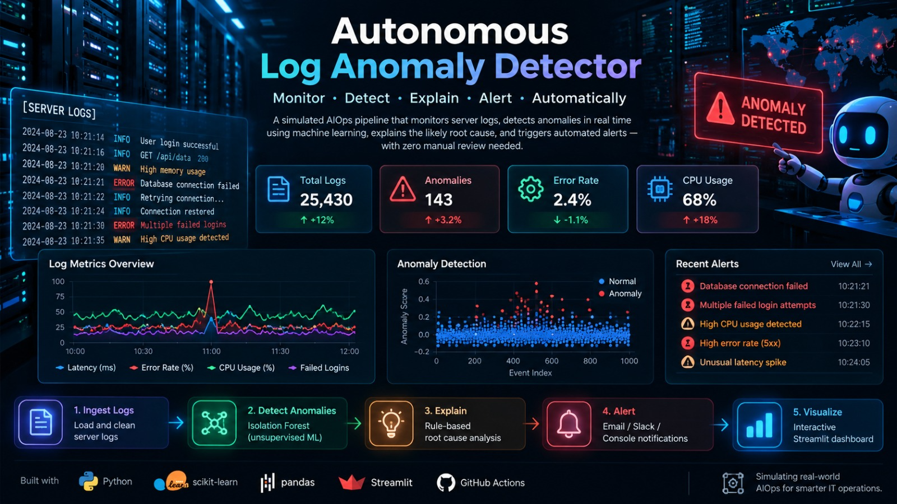

# 🔍 Autonomous Log Anomaly Detector

A simulated AIOps pipeline that monitors server logs, detects anomalies in real time using unsupervised machine learning, explains the likely root cause, and triggers automated alerts — with zero manual review needed.

## Why this project

Enterprise IT operations (this is essentially what IBM Watson AIOps does) generate huge volumes of logs that no human can watch continuously. This project automates the detect → explain → alert loop:

1. *Detect* anomalies in metrics like latency, error rate, failed logins, and CPU usage using an Isolation Forest model (no labeled data needed).
2. *Explain* each anomaly in plain English using a transparent rule-based root-cause engine.
3. *Alert* automatically via console/email/Slack the moment something looks wrong.
4. *Automate* the whole pipeline with GitHub Actions so it runs on every push.

🚀 Features

Automated Log Monitoring — Processes simulated server logs continuously.

Unsupervised Anomaly Detection — Uses an Isolation Forest model to identify unusual behavior without requiring labeled training data.

Root Cause Analysis — Applies transparent rule-based logic to explain detected anomalies in plain English.

Automated Alerting — Supports console, email, and Slack-based notifications.

Interactive Dashboard — Provides a Streamlit interface for viewing logs, anomalies, metrics, and analysis.

Synthetic Log Generation — Generates realistic server/application logs with injected anomalous events.

CI Automation — GitHub Actions can be used to automate pipeline execution and validation.

## Architecture

log_generator/generate_logs.py   → simulates server logs (normal + injected anomalies)
        ↓
src/ingest.py                    → loads and cleans log data
        ↓
src/anomaly_detector.py          → Isolation Forest flags anomalous rows
        ↓
src/root_cause.py                → rule-based plain-English explanation
        ↓
src/alert.py                     → console / email / Slack notification
        ↓
dashboard/app.py                 → Streamlit UI to visualize everything live

## Quickstart

bash
# 1. Clone and install
git clone <your-repo-url>
cd log-anomaly-detector
pip install -r requirements.txt

# 2. Generate sample logs
python log_generator/generate_logs.py

# 3. Run anomaly detection from the command line
cd src
python anomaly_detector.py
python root_cause.py

# 4. Or launch the interactive dashboard
cd ..
streamlit run dashboard/app.py

## Enabling real alerts (optional)

Set these environment variables to enable real email or Slack alerts instead of console-only:

bash
export SMTP_HOST=smtp.gmail.com
export SMTP_PORT=587
export SMTP_USER=your_email@gmail.com
export SMTP_PASS=your_app_password
export ALERT_TO_EMAIL=oncall@example.com

export SLACK_WEBHOOK_URL=https://hooks.slack.com/services/XXX/YYY/ZZZ

## Tech Stack

- *Python* — core pipeline
- *scikit-learn* (Isolation Forest) — unsupervised anomaly detection
- *pandas* — data processing
- *Streamlit* — live dashboard
- *GitHub Actions* — CI automation, runs the full pipeline on every push

## Possible extensions

- Replace the CSV log source with a real Elasticsearch/Loki/CloudWatch feed
- Add an LSTM Autoencoder for sequential/time-series anomaly detection
- Auto-trigger real remediation (e.g., restart a service via SSH/API) instead of just alerting
- Add a feedback loop where engineers mark false positives to improve thresholds over time

## License

MIT — free to use and modify.